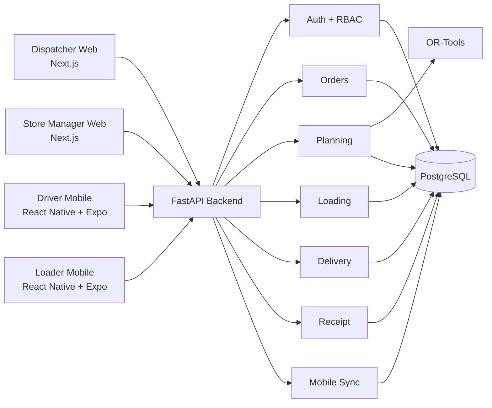
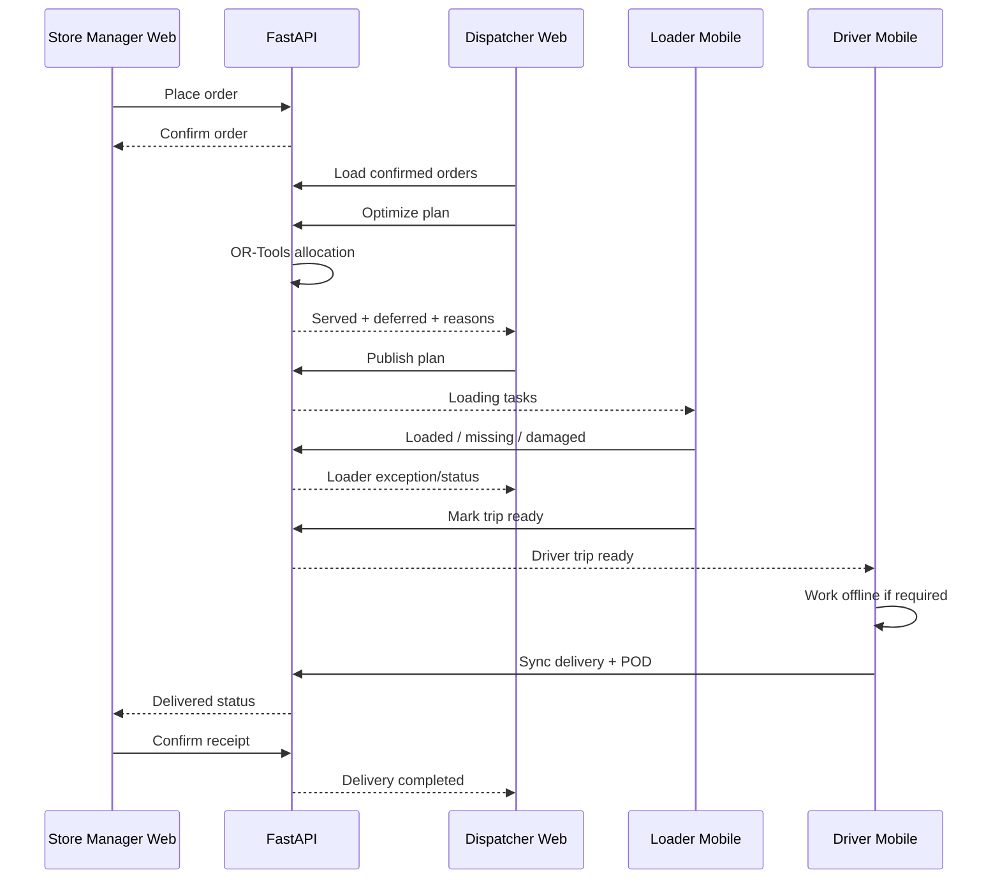
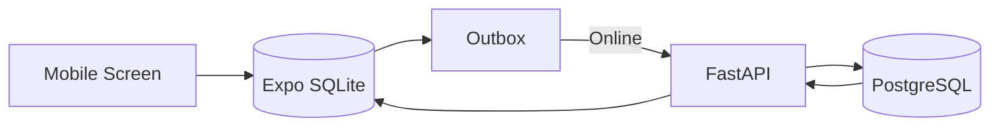

# Waypoint Hackathon Architecture — Final Lean Version

> **Deadline:** 4 October 2026, 11:59 PM Sri Lanka time  
> **Goal:** finish a stable MVP before the deadline, using the existing Designathon UI as the implementation specification.

---

# 1. Final architecture decision

## Clients

| Role | Platform | Technology | Owners |
|---|---|---|---|
| Dispatcher | Web | Next.js + React + TypeScript | Abish, Adrian |
| Store Manager | Web | Next.js + React + TypeScript | Abish, Adrian |
| Driver | Mobile | React Native + Expo + TypeScript | Sivananthi, Vashika, Lisha |
| Loader | Mobile | React Native + Expo + TypeScript | Sivananthi, Vashika, Lisha |

## Backend

| Area | Technology | Owners |
|---|---|---|
| Shared backend | FastAPI + Python | Loheeshan, Krish, Lisha |
| Database | PostgreSQL | Loheeshan, Krish |
| Planning engine | OR-Tools | Loheeshan, Krish |
| Mobile sync | FastAPI + PostgreSQL | Loheeshan, Krish, Lisha |
| Authentication / RBAC | FastAPI JWT | Loheeshan, Krish |
| POD/image persistence | **PostgreSQL BYTEA for MVP** | Backend team |

## Important simplification

No S3 / MinIO / paid object storage.

For the Hackathon:

- Driver compresses POD images before upload.
- Backend stores the image as `BYTEA` in PostgreSQL.
- Recommended image limit: 500 KB to 1 MB.
- This is acceptable for the small seeded demo dataset.
- After the competition, move files to object storage if needed.

This removes:
- S3 cost;
- bucket configuration;
- MinIO service;
- object-storage auth/debugging;
- extra deployment complexity.

---

# 2. System diagram



---

# 3. Architecture style

Do **not** build many independent microservices before the deadline.

Use:

```text
FastAPI modular monolith
+
one PostgreSQL database
+
one planning module
```

Backend modules:

```text
auth/
orders/
fleet/
planning/
loading/
delivery/
receipts/
sync/
audit/
```

This is much safer for a junior team and a four-day implementation window.

---

# 4. Repository structure

```text
TeamName_SolutionName/
├── README.md
├── docker-compose.yml
├── .env.example
├── .gitignore
│
├── apps/
│   ├── web/
│   │   ├── app/
│   │   │   ├── dispatcher/
│   │   │   └── store/
│   │   ├── features/
│   │   └── tests/
│   │
│   ├── driver-mobile/
│   │   ├── app/
│   │   ├── src/
│   │   └── tests/
│   │
│   ├── loader-mobile/
│   │   ├── app/
│   │   ├── src/
│   │   └── tests/
│   │
│   └── api/
│       ├── app/
│       │   ├── auth/
│       │   ├── orders/
│       │   ├── fleet/
│       │   ├── planning/
│       │   ├── loading/
│       │   ├── delivery/
│       │   ├── receipts/
│       │   ├── sync/
│       │   └── audit/
│       ├── migrations/
│       └── tests/
│
├── packages/
│   ├── api-contracts/
│   ├── shared-types/
│   └── design-tokens/
│
├── data/
│   └── seed/
│
├── scripts/
│   ├── seed.py
│   └── validate-plan.py
│
├── docs/
│   ├── architecture.md
│   ├── Dispatcher-architecture.md
│   ├── Store-manager-architecture.md
│   ├── Driver-architecture.md
│   ├── Loader-architecture.md
│   ├── data-model.md
│   ├── ai-disclosure.md
│   └── design-deviations.md
│
├── AGENTS.md
└── CONTRIBUTING.md
```

---

# 5. Core business flow



---

# 6. Planning rules that must work

The planner must check:

```text
1. weight capacity
2. volume capacity
3. chilled -> reefer vehicle
4. van_only -> van
5. outlet delivery window
6. vehicle home depot
7. weekly fuel quota
8. maximum 2 trips / vehicle / day
9. unavailable vehicle cannot be used
10. every order = served OR deferred
```

The Challenge Booklet explicitly requires capacity, temperature, access, delivery windows and fuel quotas to be respected.

---

# 7. Lean planning engine

Do not build a research-grade optimizer now.

Use this flow:

```text
confirmed orders
 -> validate obvious impossible cases
 -> build compatible vehicle list
 -> assign with OR-Tools CP-SAT
 -> create trip groups
 -> sequence stops
 -> independently validate
 -> defer remaining orders
 -> return reason codes
```

Reason codes:

```text
NO_COMPATIBLE_VEHICLE
REEFER_CAPACITY_EXHAUSTED
VAN_CAPACITY_EXHAUSTED
WEIGHT_CAPACITY
VOLUME_CAPACITY
TIME_WINDOW
FUEL_QUOTA
VEHICLE_UNAVAILABLE
TRIP_LIMIT
```

---

# 8. Database model

Core tables only:

```text
users
roles
user_roles

depots
outlets
vehicles
vehicle_availability
vehicle_fuel_usage

orders

plans
plan_revisions
plan_assignments
trips
trip_stops
deferral_decisions

load_events
delivery_events
proof_of_delivery
receipt_confirmations

sync_events
audit_events
```

## POD table

```text
proof_of_delivery
- id
- delivery_event_id
- receiver_name
- photo_mime_type
- photo_bytes BYTEA
- created_at
```

For the Hackathon this is simpler than S3.

---

# 9. Mobile offline architecture

## Driver + Loader

Use:

```text
Expo SQLite
Expo SecureStore
NetInfo
```

Local data:

```text
cached_trips
cached_stops
outbox_events
sync_state
```

Flow:



Every action:
1. save locally;
2. mark `pending`;
3. continue workflow;
4. sync when network returns;
5. mark `synced`.

---

# 10. API surface

## Auth

```text
POST /api/v1/auth/login
GET  /api/v1/me
```

## Store Manager

```text
GET  /api/v1/store/orders
POST /api/v1/store/orders
GET  /api/v1/store/orders/{id}
POST /api/v1/store/orders/{id}/receipt
```

## Dispatcher

```text
GET  /api/v1/dispatcher/orders
GET  /api/v1/fleet
POST /api/v1/plans
POST /api/v1/plans/{id}/optimize
GET  /api/v1/plans/{id}
POST /api/v1/plans/{id}/publish
GET  /api/v1/operations/live
```

## Loader

```text
GET  /api/v1/loader/trips
GET  /api/v1/trips/{id}/loading
POST /api/v1/trips/{id}/load-events
POST /api/v1/trips/{id}/ready
```

## Driver

```text
GET  /api/v1/driver/trips
GET  /api/v1/trips/{id}
POST /api/v1/trips/{id}/start
POST /api/v1/sync/events
POST /api/v1/trips/{id}/stops/{stopId}/pod
```

---

# 11. Team ownership

## Web team

### Abish
Primary:
- Dispatcher frontend
- Dispatcher integration
- shared web components

Secondary:
- Store Manager frontend

### Adrian
Primary:
- Store Manager frontend
- Dispatcher frontend support

Secondary:
- web API integration
- responsive fixes
- web testing

## Mobile frontend

### Sivananthi
Primary:
- Loader mobile UI
- shared mobile components

### Vashika
Primary:
- Driver mobile UI
- offline state UX

### Lisha
Primary:
- Driver/Loader API integration
- mobile shared state
- assists backend mobile endpoints

## Backend

### Loheeshan
Primary:
- backend architecture
- planning engine
- integration
- merge/release control

### Krish
Primary:
- PostgreSQL
- auth/RBAC
- API modules
- planning constraints

### Lisha
Primary:
- mobile sync endpoints
- delivery/loading endpoints
- mobile/backend integration

---

# 12. Branch ownership

```text
feature/dispatcher-*        -> Abish / Adrian
feature/store-*             -> Adrian / Abish
feature/driver-*            -> Vashika / Lisha
feature/loader-*            -> Sivananthi / Lisha
feature/mobile-shared-*     -> Lisha
feature/api-*               -> Loheeshan / Krish / Lisha
feature/planning-*          -> Loheeshan / Krish
feature/db-*                -> Krish
```

No one commits directly to:

```text
main
dev
```

---

# 13. Git flow

```text
main
 └── dev
      ├── feature/dispatcher-plan-board
      ├── feature/store-order-flow
      ├── feature/driver-offline
      ├── feature/loader-loading
      ├── feature/api-orders
      └── feature/planning-allocation
```

Start:

```bash
git checkout dev
git pull origin dev
git checkout -b feature/driver-offline
```

Commit:

```bash
git add <relevant files>
git commit -m "feat(driver): add offline delivery queue"
```

Push:

```bash
git push -u origin feature/driver-offline
```

Then:

```text
feature/* -> Pull Request -> dev
```

Final:

```text
dev -> integration test -> Pull Request -> main
```

---

# 14. Commit format

```text
feat(dispatcher): add plan board
feat(store): add order confirmation
feat(driver): add offline stop persistence
feat(loader): add shortfall capture
feat(api): add mobile sync endpoint
feat(planning): enforce reefer compatibility
fix(sync): prevent duplicate event replay
test(planning): cover overloaded delivery day
```

Avoid:

```text
update
done
final
changes
fix
```

---

# 15. Four-day execution plan

## 30 Sep — Foundation + API contracts

### Loheeshan / Krish / Lisha
- FastAPI scaffold
- PostgreSQL models
- login/RBAC
- seed users
- outlets/vehicles/orders seed
- API contracts freeze

### Abish / Adrian
- Next.js scaffold
- role auth
- Dispatcher base layout
- Store base layout

### Sivananthi / Vashika / Lisha
- Driver Expo scaffold
- Loader Expo scaffold
- login/navigation
- shared API client

**End-of-day target:** all four clients can log in and call backend.

---

## 1 Oct — Core flows

### Web
- Store order flow
- Dispatcher order queue
- Dispatcher planning UI

### Mobile
- Loader assigned trip
- Driver assigned trip
- stop screens

### Backend
- order APIs
- trip APIs
- load APIs
- delivery APIs
- basic OR-Tools assignment

**End-of-day target:** Store -> Dispatcher -> published trip -> Loader/Driver data path works.

---

## 2 Oct — Failure/offline/planning

### Backend
- all hard constraints
- deferred order logic
- reasons
- independent plan validator

### Driver
- Expo SQLite
- offline event outbox
- POD
- reconnect sync

### Loader
- missing/damaged flow
- offline local save
- dispatcher update

### Web
- deferral review
- publish screen
- live operations basics

**End-of-day target:** required degradation flow works.

---

## 3 Oct — Full integration day

No major new features.

Run:

```text
Store Manager
 -> Dispatcher
 -> Loader
 -> Driver offline
 -> reconnect
 -> Store receipt
 -> Dispatcher completion
```

Fix only:
- blockers;
- integration bugs;
- responsive bugs;
- broken seed;
- Docker problems;
- auth problems.

Also complete:
- README
- architecture docs
- data model
- AI disclosure
- design deviations
- judge walkthrough.

**End-of-day target:** release candidate.

---

## 4 Oct — Submission day

Morning:
- deploy;
- verify public URL;
- verify four accounts;
- fresh Docker test.

Afternoon:
- record 5–8 minute video;
- final README check;
- final Git tag.

Recommended freeze:
**6 PM Sri Lanka time.**

After freeze:
- only critical fixes.

Submit well before 11:59 PM.

---

# 16. Scope freeze

## Must have

```text
login
4 roles
Store order
Dispatcher allocation
served + deferred
hard constraints
publish plan
Loader loading
Loader shortfall
Driver trip
Driver offline delivery
POD
sync recovery
Store receipt
seed accounts
Docker Compose
README walkthrough
architecture docs
AI disclosure
```

## Nice to have only after must-have works

```text
advanced maps
live GPS
push notifications
complex animations
multiple optimization strategies
native iOS polish
analytics dashboards
forecast screens
complex admin
```

Do not spend deadline time on nice-to-have features.

---

# 17. Development Guardian

Before push, agent checks:

```text
correct Figma screen
correct role
API integrated
no secret
tests pass
mobile offline works if relevant
planning rules not bypassed
commit message correct
branch based on dev
```

Output:

```text
BLOCKERS
WARNINGS
TESTS TO RUN
RECOMMENDED COMMIT
SAFE TO PUSH: YES/NO
```

---

# 18. AI Budget Manager

Rules:

```text
Do not send whole repo.
Send feature folder + contract + relevant architecture.
Reuse existing decisions.
Do not ask Codex and Claude to build same feature.
Use one agent to implement and one to review.
Always request changed files + tests + remaining issues.
```

---

# 19. Deployment without S3

Minimum production services:

```text
web
api
postgres
```

Optional:
```text
worker
redis
```

If planning can run within API request time for the demo, skip Redis/worker and call OR-Tools directly inside FastAPI.

That is even simpler.

Final minimal deployment:

```text
Next.js
FastAPI
PostgreSQL
```

Mobile apps connect directly to the public FastAPI URL.

---

# 20. Final architectural principle

For this deadline:

**working end-to-end flow > theoretical architecture purity**

The judges score engineering quality, but an unfinished distributed system is worse than a clean modular application that completes the full workflow.
