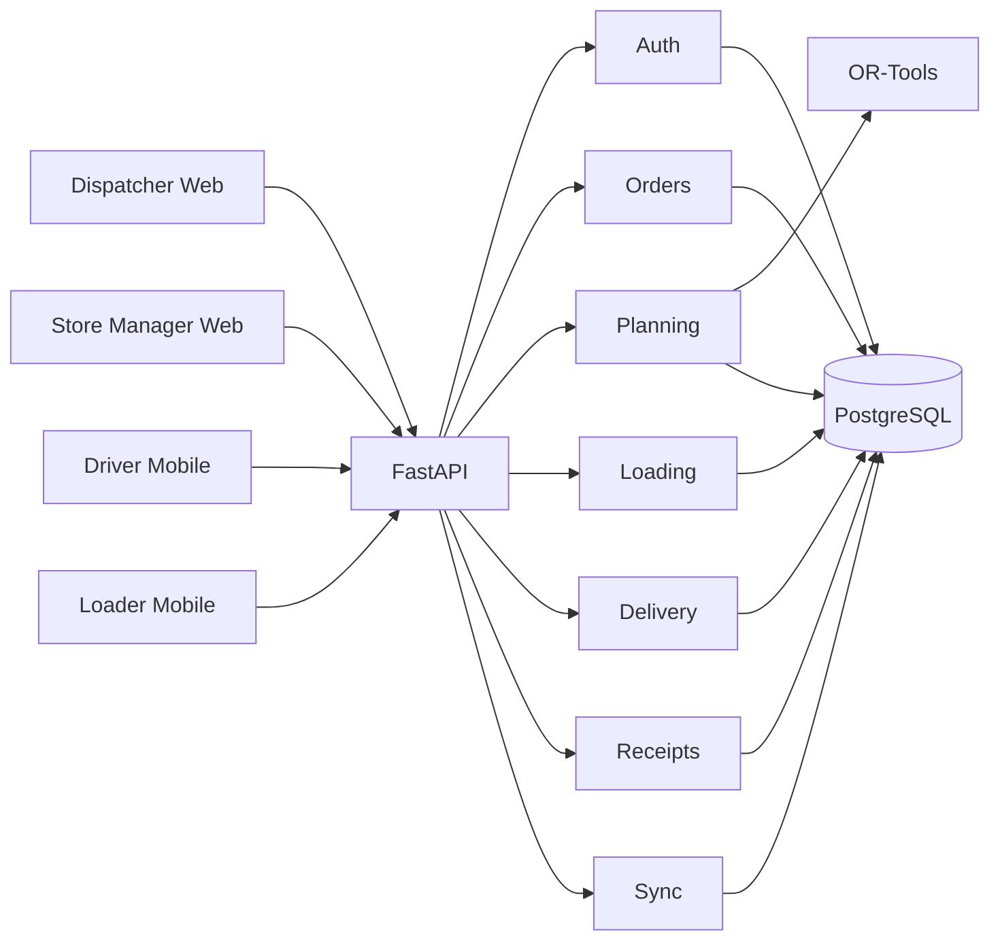
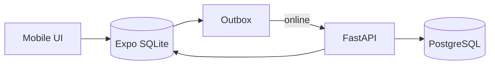

# System Architecture

## Client platforms

| Role | Platform | Technology |
|---|---|---|
| Dispatcher | Web | Next.js + React + TypeScript |
| Store Manager | Web | Next.js + React + TypeScript |
| Driver | Native mobile | React Native + Expo + TypeScript |
| Loader | Native mobile | React Native + Expo + TypeScript |

## Backend

```text
FastAPI modular backend
PostgreSQL
OR-Tools planning module
```

Backend modules:

```text
auth/
orders/
fleet/
planning/
loading/
delivery/
receipts/
sync/
audit/
```

## Diagram



## Storage

No S3 for MVP.

POD:
```text
mobile compresses image
-> FastAPI upload
-> PostgreSQL BYTEA
```

## Offline mobile



## Planning flow

```text
confirmed orders
-> validate impossible cases
-> compatibility matrix
-> OR-Tools allocation
-> sequence trips
-> independent validator
-> deferred reasons
-> Dispatcher review
-> publish revision
```

Hard rules:
- weight
- volume
- chilled/reefer
- van-only
- delivery windows
- home depot
- weekly fuel quota
- max 2 trips/day
- vehicle availability
- served/deferred

The individual-order compatibility stage is implemented in
`apps/api/app/planning/compatibility.py`, with a depot-scoped live preview at
`GET /api/v1/plans/{plan_id}/compatibility`. It checks depot, exact-day vehicle
availability, temperature/access compatibility and each order's weight/volume.
It returns candidate vehicles and all pair exclusions, without allocating shared
capacity or writing outcomes. Preview pagination is not a complete solver input
snapshot. Candidate status is not route feasibility.

The next stage, `apps/api/app/planning/allocation.py`, implements capacity-only
OR-Tools CP-SAT allocation: whole orders, combined weight/volume, compatibility,
and at most two candidate trip slots per vehicle. It maximizes allocated order
count then minimizes trips. The result includes every unallocated order and
reports whether that capacity objective is proven optimal. It has no HTTP route
or persistence yet. Route timing, fuel, existing operational trips and independent
full-plan validation remain pending; capacity results cannot be published.

## Published plan rule

Published plans are immutable. Changes create new plan revisions.
